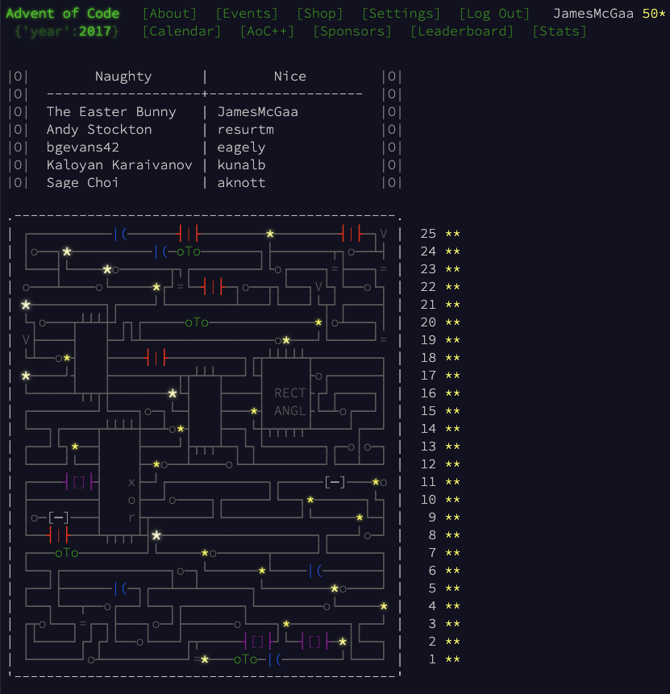

# Advent of Code 2017

# Context

I originally completed most of this year in 2023, later revisiting 18-25 (which is where I will select favorites from) in 2024 - all in Kotlin.

Overall this was an easier year, problems were straightforward to implement and did not require much optimization.
# Favorite Problems 

- 21: Growing an image over iterations according to a map of subpatterns to subpatterns
- 23: Classic hand disassembly
- 24: Straightforward tail recursion