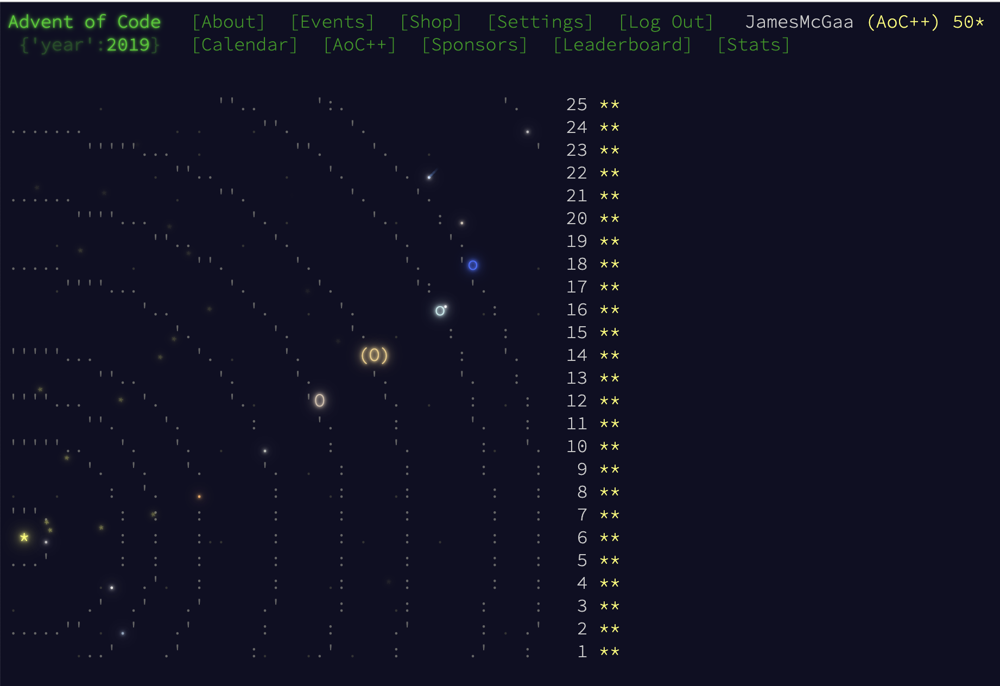

# Advent of Code 2019

# Context

I used Kotlin in Intellij to complete this year in its entirety. I do believe 2019 lives up to its reputation as one of the hardest Advent of Code years of all time.

Much success depends on how well you setup your Intcode computer which I didn't really get until I abstract classed it in p17.

# Favorite Problems

- 10: This problem had unique vector math including angles and rotation. I enjoyed the spinning laser on part B.
- 14: A difficult problem concerning backtracking a set of chemical formulas.
- 15: Intcode to manipulate exploring a maze "blind". Really cool solution to freeze copies of the Intcode at each step.
- 16: A "key insight needed" problem in terms of understanding dotWithOffset()
- 17: Traversing a graph with 3 repeating sets of directions. Lots of code + handwork involved.
- 18: The "keys and doors" BFS problem. I had to majorly reduce the size of the graph in part 2 - highly difficult
- 20: A pleasant BFS with teleporter problem.
- 21: An Intcode logic puzzle with the frog jumping game. Lots of handwork involved here.
- 22: Pure number theory - highly difficult
- 23: Intcode in a network - fun
- 24: Infinitely recursive game of life - fun
- 25: An actual game in Intcode you play by hand - fun
