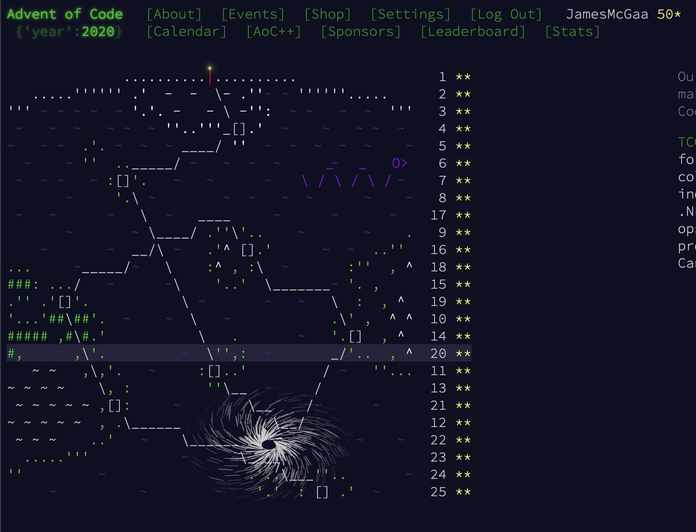

# Advent of Code 2020

# Context

I originally completed most of this year (my first) in **Python3**. Later I revisited 19,20,22-25 in **Kotlin**.

Overall many of these did not require too much optimizing, which lead to a pleasant focus on problem solving over coding details.
# Favorite Problems

- 19: I learned the CYK algorithm and CNF grammars for this problem - very difficult
- 20: A cool problem about aligning subimages via rotations and flips - stitching them into an overall larger picture to find the "loch ness monster" - very difficult
- 22: Pleasant recursion
- 23: Pleasant linked list operations