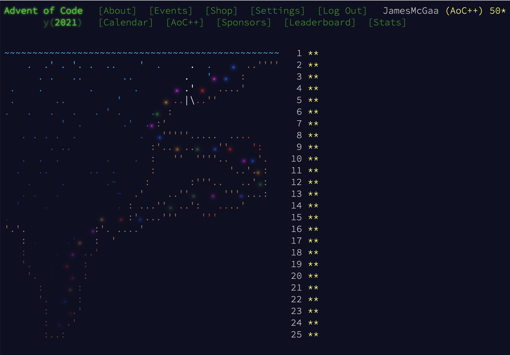

# AdventAcademy2021

Solutions to [Advent of Code 2021](https://adventofcode.com/2021) in **Python 3.10**
Some standout questions for this year included 
- Problem 16: Packet parsing
- Problem 17: Projectile motion 
- Problem 18: Binary trees
- Problem 19: Orienting 3D Sample Data - my favorite
- Problem 22: Intersections of cubes - has a clever trick
- Problem 23: Difficult graph formulation + Dijkstra's

