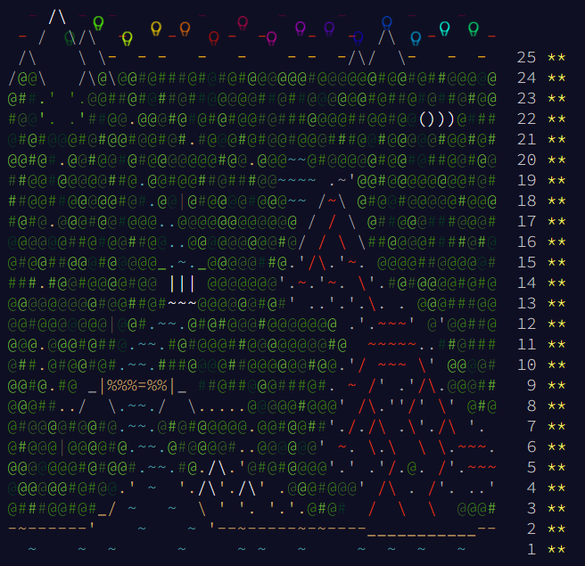

# Advent of Code 2022

# Context

This was my third AOC attempt and second time completing it in its entirety. I did this for fun this year and did not compete for leaderboards. 

Mostly I attempted these problems to explore Kotlin scripting - I've worked in Android but never attempted algo-style questions in Kotlin. 

# Favorite Problems 

- 7: Generating and navigating a tree on the fly from cd / ls commands 
- 13: Implementing a nested list parser as well as implementing a tricky recursive operation 
- 15: Finding a unique point not covered by Beacons - had to exploit the fact the solution was unique and this search on the intersection of borders + 1 
- 16: BFS but with 2 actors moving simultaneously. Packed state into the bits of integers as an optimization
- 17: Probably the hardest one. This was simulating trillions of tetris moves. Had to hash the state of the board cleverly to find the cycle. This was the first time I ever had hash map collisions hinder me.
- 18: "Flood Fill"
- 19: Geode Miner. This was a super huge BFS which required a ton of pruning + rules (don't build bots past a certain point) to get the runtime to a reasonable spot.
- 21: Monkeys which represent arithmetic operationgs. Had to find a variable values that zeroes it. Probably needed to find an LP solution or do something more clever. I ended up just doing steps to get closer to the answer with integer division, then once an approximate solution was found I searched nearby integers while baning "fractional division"
- 22: Cube simulator: This was just painful. I had to cut out a paper cube and write a bunch of logic for rotating when moving to another face.
- 24: BFS across a changing board. Ended up doing a multilayer BFS for each point in the cycle.
- 25: Numbers mod 5, but with -2, -1, 0, 1, 2. A simple transformation does this eligantly 

Overall another enjoyable year. Others included BFS, stacks, sliding windows, game of life, keeping numbers small by continuously reducing mod n.
