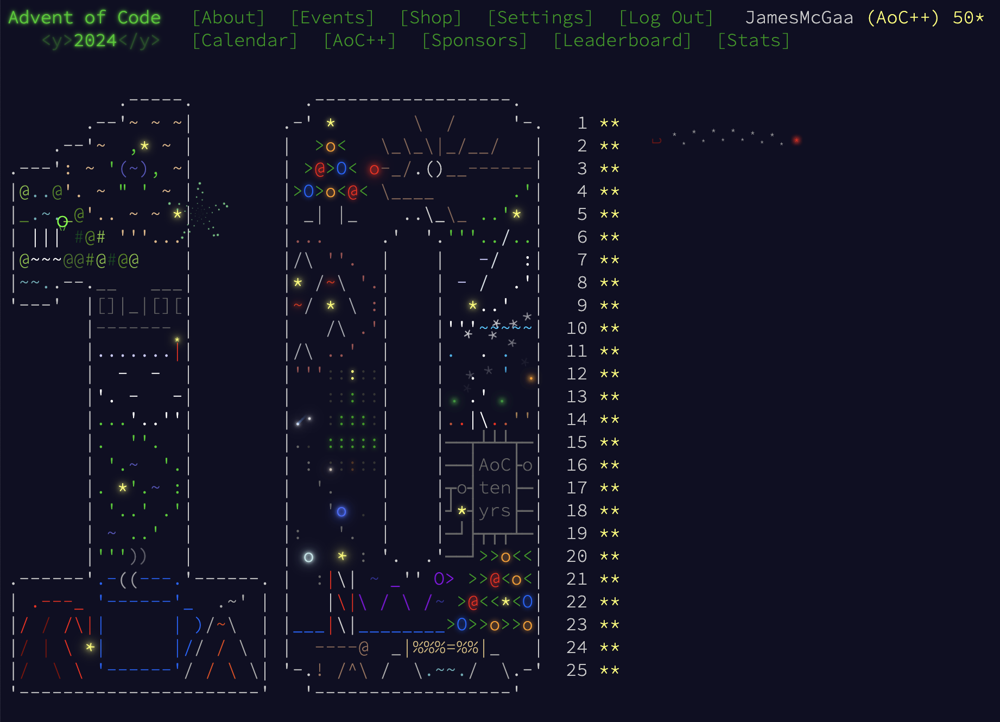

# Advent of Code 2024

# Context

Advent of Code 2024 - all in **Kotlin** 

This was a pretty standard year of Advent of Code. For performance this year I added created KotlinUtils/utils.kt

# Notable Problems
- 3: Regex and MatchResults
- 12: Counting "Sides" in a graph
- 14: Letting Coords run until they form a Christmas Tree image
- 15: Pushing boxes in a grid - my **favorite problem** of the year
- 16: Modifying Dijkstra to return all possible previous nodes in a among all shortest paths
- 17: Hand disassembly + reverse engineering using complicated bitwise logic - highly **difficult**
- 21: Hard to understand recursion - **most difficult** problem of the year
- 23: Learned an esoteric algorithm - Bron-Kerbosch
- 24: Learned **Graphviz** for debugging part 2 of this problem
