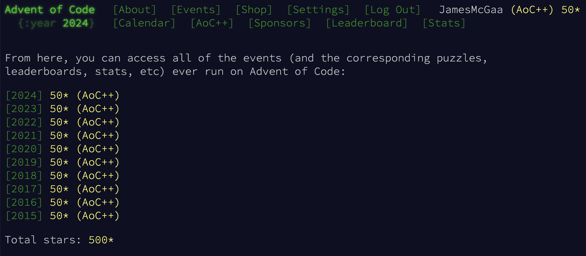

# AdventOfCodeAll
All years of Advent of Code - all code here is my own except where explicitly cited

Primarily in Kotlin IntelliJ projects with a few in Python - most should run out of the box if the inputs are correctly added to the input folder of the project as inputs<x>.txt

For a few of the years I have a README in the subdirectory for the year with a recap and analysis of my favorite problems

